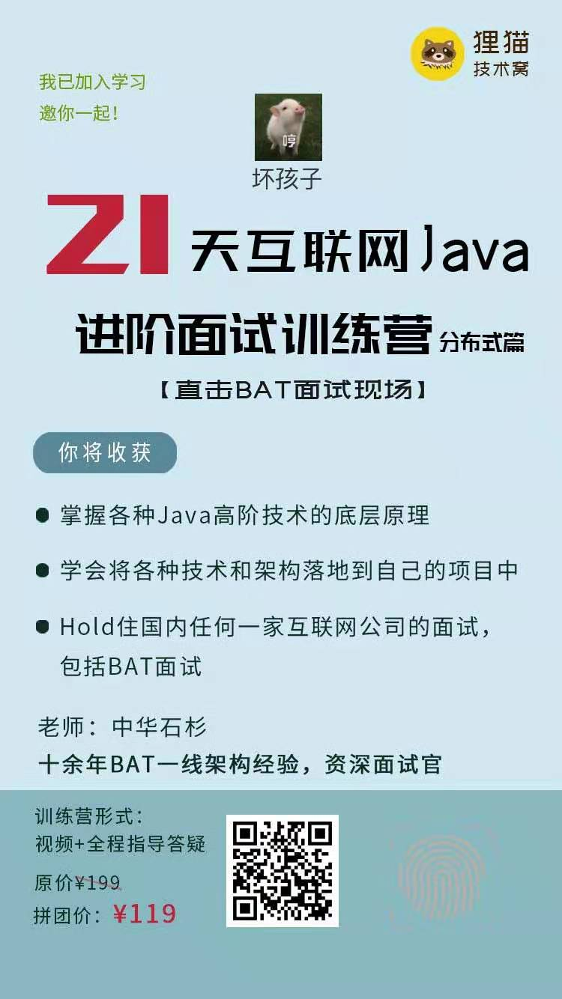

### spring-cloud 学习项目

本项目是学习《中华石杉老师-21天互联网Java进阶面试训练营（分布式篇）》课程时自己整理的笔记和代码试验，希望对大家有所帮助。
课程质量是当前市面上最好的，没有之一。可以扫一个下面二维码加入



也可以微信上从下面链接进去：[https://apppuKyPtrl1086.h5.xiaoeknow.com/content_page/eyJ0eXBlIjoiMyIsInJlc291cmNlX3R5cGUiOiI2IiwicmVzb3VyY2VfaWQiOiIiLCJwcm9kdWN0X2lkIjoicF81ZDMxMTBjM2MwZTlkX0ZubVRUdGo0IiwiYXBwX2lkIjoiYXBwcHVLeVB0cmwxMDg2Iiwic2hhcmVfdXNlcl9pZCI6InVfNWQyMjllMWNkZDY4MV8yV21sd1pzTWRLIiwic2hhcmVfdHlwZSI6NX0](https://apppuKyPtrl1086.h5.xiaoeknow.com/content_page/eyJ0eXBlIjoiMyIsInJlc291cmNlX3R5cGUiOiI2IiwicmVzb3VyY2VfaWQiOiIiLCJwcm9kdWN0X2lkIjoicF81ZDMxMTBjM2MwZTlkX0ZubVRUdGo0IiwiYXBwX2lkIjoiYXBwcHVLeVB0cmwxMDg2Iiwic2hhcmVfdXNlcl9pZCI6InVfNWQyMjllMWNkZDY4MV8yV21sd1pzTWRLIiwic2hhcmVfdHlwZSI6NX0)


### 如何运行项目
首先运行 Eureka 服务注册中心 eureka-server

然后依次运行 各服务 credit-service、inventory-service、wms-service、order-service

#### 2019-08-08 更新

已加入 Zuul 网关，并结合数据库方式实现了动态路由功能。

#### 2019-08-11 更新

Zuul 二次开发,实现了灰度发布方案。

#### 2019-08-19 更新 

生产环境的超时重试配置

Spring cloud 线上可能出现第一次超时的问题。生产环境优化点。

第一次启动，人家调用你的时候会出现 timeout 的情况。

引起的原因：

每个服务第一次被请求调用，回去初始化一个 Ribbon 的组件，初始化这些组件需要耗费一定的时间，所以很容易导致超时问题。
解决办法就是让服务启动的时候就直接初始化，不在第一次调用的时候初始化。

四个点的优化：

1、ribbon 开启启动直接初始化

```
ribbon:
  eager-load:
    enabled: true
```

2、eureka server 

```
eureka:
  instance:
    hostname: localhost
    # 服务超过2 秒没有上报，就视为
    lease-expiration-duration-in-seconds: 2
  client:
    registerWithEureka: false
    fetchRegistry: false
    serviceUrl:
      defaultZone: http://localhost:8761/eureka/
  server:
    enableSelfPreservation: false
    # 缓存信息 100ms 同步一次
    response-cache-update-interval-ms: 100
    # 每隔多少秒去检查心跳 1秒
    eviction-interval-timer-in-ms: 1000
```

3、各服务的eureka client 配置
```
eureka:
  instance:
    hostname: localhost
  client:
    serviceUrl:
      defaultZone: http://localhost:8761/eureka
    # 每隔一秒拉取一次
    registry-fetch-interval-seconds: 1
    # 向服务注册时间 一秒一次
    instance-info-replication-interval-seconds: 1
```
4、网关 zuul 中的 ribbon 全局配置 延长超时时间

```
ribbon:
  ConnectTimeout: 3000
  ReadTimeout: 3000
  OkToRetryOnAllOperations: true
  MaxAutoRetries: 1
  MaxAutoRetriesNextServer: 1
```

中小型的系统，没必要直接开启hystrix，资源隔离、熔断、降级，如果你没有设计好一整套系统高可用的方案。

zuul请求一个订单服务，超过1秒就认为超时了，此时会先重试一下订单服务这台机器，如果还是不行就重试一下订单服务的其他机器。

超时时间大于 上面的 ribbon 的超时时间就行了。

```$xslt
hystrix:
  command:
    default:
      execution:
        isolation:
          thread:
            timeoutInMilliseconds: 10000
```
